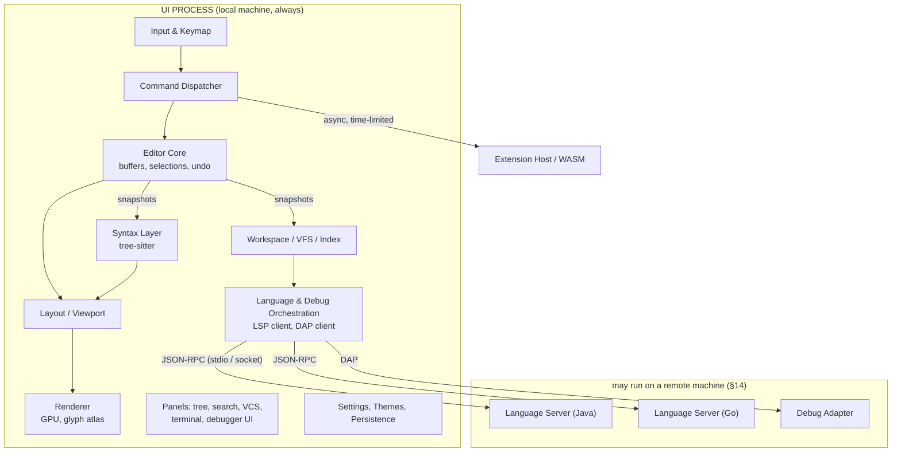
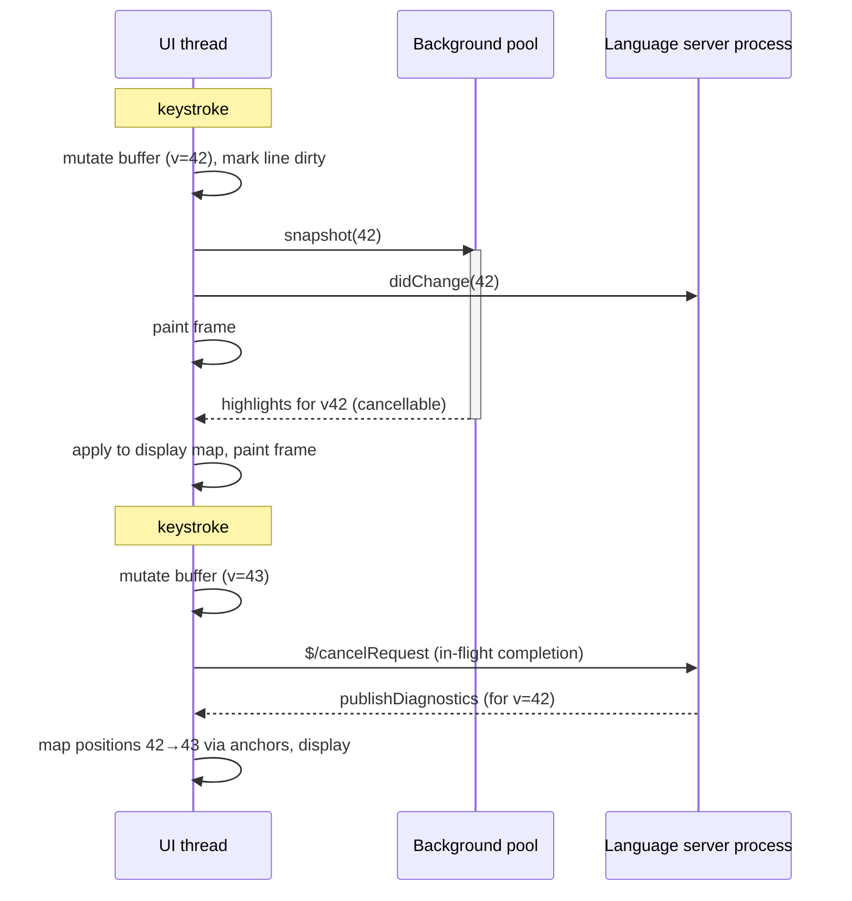

# Vulcan: Language, Architecture, and System Design

A single reference for the Vulcan IDE — the evidence behind the language and architecture decision, the system design that follows from it, the hardware, platform, richness and plugin constraints, and the roadmap. Vulcan takes its look, feel, and workflow from IntelliJ; everything under the hood is designed to be faster.

---

## 1. Executive summary

Vulcan is a desktop IDE with IntelliJ's look, feel, and workflow richness, built to be measurably snappier than every current alternative when editing any language, locally or against a remote machine, on a 5-CPU / 12 GB laptop running macOS, Linux, or Windows, with a plugin system from day one.

The decisions this document makes, and why:

- **Language and runtime: Rust, single process, GPU-rendered.** The fastest languages for an editor core are C, C++, Rust, and Zig — all native, no garbage collector — and the measured difference between them for this workload is noise. Rust wins on memory safety, ecosystem, and the existence of two open-source, IDE-grade reference implementations (Zed, Lapce). The 12 GB memory budget rules out a JVM core in practice: a JVM IDE process starts near its entire allowance before a project is loaded and then competes for RAM with the JVM language servers it must spawn.
- **Architecture, not language, is where snappiness comes from.** The best public latency dataset shows the same JVM editor moving from ~25 ms mean / 240 ms max typing latency to ~3 ms mean by fixing a lock and a repaint strategy — a 20× swing with the language held constant. The spread between a well-built native and a well-built JVM editor is a few milliseconds; the spread between good and bad architecture in the same language is tens to hundreds. The "C for a 10% win" idea is therefore dropped: there is no reliable 10% to be had, and C would cost months of solo productivity for it.
- **The one design we reject outright: an RPC boundary between keystroke and glyph.** The original React/TypeScript-frontend-plus-Java-backend-over-LSP plan puts serialization on the hot path. That is the mistake that ended the xi-editor project and the reason VS Code's typing measurably lags native editors. LSP is the right boundary for semantics and never for text editing or rendering.
- **"Snappy on any language" is a boundary-design property.** Tree-sitter in-process for syntax, LSP and DAP out-of-process for semantics and debugging, and an editor that never waits on a server. The core language is nearly irrelevant to this goal; the placement of the boundaries is everything.
- **Remote development pins the local/remote split.** UI, buffer, undo, and syntax highlighting stay local; file system, indexer, language servers, debug adapters, and terminals run remote. Every serious implementation (VS Code Remote, JetBrains Gateway/Fleet, Zed) converged on this split independently.
- **Plugins are architected on day one and published later.** Declarative language/theme/keymap packs first, then sandboxed WASM extensions with capability-based permissions, executed off the UI thread on snapshots. Vulcan's own Java pack ships through that system before any third party sees the API.

The rest of this document supplies the evidence for these decisions (§4–§6), the system design that follows from them (§7–§16), the hardware, platform, richness and plugin constraints (§17), resilience (§18), and a staged roadmap with the thresholds that would change the recommendation (§19).

---

## 2. Goals and constraints

**Product thesis:** IDE-grade capability at editor-grade latency, uniform across languages, local or remote. Every feature is either table stakes for an IDE or serves that sentence directly.

| Constraint | Consequence for the design |
|---|---|
| Snappy when editing *any* language | Language-agnostic syntax layer (tree-sitter) and a semantics boundary (LSP/DAP) that can never block the editor |
| IntelliJ look, feel, keymap, and workflow richness | Theming and layout conventions, an IntelliJ keymap as data, and a feature set defined in §17.4 — none of which constrains the core architecture |
| Better under the hood than IntelliJ | Native core, GPU rendering, sub-frame keystroke latency, small footprint, no in-process plugin risk |
| Remote development and remote debugging | A headless remote agent behind the same interfaces as the local implementation (§14) |
| macOS, Linux, Windows | One `platform` module owning every OS difference; CI on all three from the first commit (§17.3) |
| 5 CPUs, 12 GB RAM | IDE process budget ≈ 500 MB idle / 1 GB with a project; small low-priority background pool; lazy servers (§17.1–§17.2) |
| Extensible with plugins | Declarative packs + sandboxed WASM, architected in milestone 1, API frozen only after Vulcan's own features ship through it (§17.5) |
| Solo/small team, experienced Java engineer, willing to learn | Rust is a real learning cost and slow to compile on 5 cores; the roadmap front-loads a spike that proves or disproves the path in weeks (§19) |

**Non-goals for v1:** a public plugin marketplace, a bespoke per-language semantic engine (IntelliJ's PSI), AI features, and any feature that adds a step to the keystroke path.

---

## 3. The mental model

Treat an IDE as a **low-latency service with one hard SLO and a lot of background workloads**.

- The **hot path** is keystroke → pixel. Budget: one frame (8.3 ms at 120 Hz, 16.6 ms at 60 Hz), measured at p99.
- Everything else — parsing, indexing, type-checking, diagnostics, search, VCS, debugging — is **background work** that operates on immutable snapshots of the editor state, can be cancelled the moment the user types, and publishes results back to the UI asynchronously.

Every component below is shaped by that split. If you remember one thing: **the UI thread owns the truth (the buffer), and everyone else works on copies of it.**

---

## 4. What the evidence says: how existing editors are built and how they perform

### 4.1 The best public latency dataset

Pavel Fatin's 2015 Typometer measurements remain the most complete like-for-like comparison of editor typing latency (same machine, Intel Core i5-3427U / HD 4000; mean / max in ms). The absolute numbers are dated; the *relative* effects are what matter.

| Editor | Windows, empty file | Windows, XML on battery | Linux, XML file |
|---|---|---|---|
| GVim | 0.9 / 1.2 | 1.4 / 2.9 | 4.5 / 8.4 |
| **IntelliJ IDEA, zero-latency mode** | **2.9 / 21.2** | **4.3 / —** | **1.7 / 3.9** |
| Notepad++ | 4.3 / 5.9 | — | — |
| Emacs (GUI) | 5.3 / 19.2 | — | — |
| Sublime Text | 8.2 / 35.2 | 12.6 / — | 23.1 / 35.4 |
| Eclipse | 10.1 / 20.8 | — | 46.5 / 87.1 |
| Netbeans | 11.8 / 31.6 | — | — |
| **IntelliJ IDEA, default mode** | **24.7 / 83.7** | **45.5 / 239.3** | **69.2 / 198.0** |
| Atom (Electron) | 49.4 / 85.5 | — | 32.5 / 59.6 |

The same JVM editor produced both the best result on Linux (beating GVim) and, in default mode, one of the worst. What changed between the two rows was not the language: default mode acquired a read/write document lock on every keystroke and repainted too much of the screen; zero-latency mode removed both. Fatin's framing of the human thresholds is also worth keeping: ~200 ms reaction time, ~40 ms for the visual system to register input, ~26 ms already consumed by keyboard and monitor I/O on typical hardware, and editor painting that should target 1–5 ms. He also showed that *jitter* — variance in latency — is as damaging as the mean.

### 4.2 The editors, one by one

**IntelliJ IDEA (JVM — Java/Kotlin, Swing).** Language intelligence is in-process on the PSI (Program Structure Interface) tree plus stub indexes; during indexing only index-free features are available ("dumb mode"). Memory is its documented weak spot: the default maximum heap is 2 GB and real footprints on medium projects are routinely several gigabytes. Its typing latency, once the zero-latency fix landed, is competitive with native editors.

**JetBrains Fleet (Kotlin/JVM, Skia via Skiko, distributed).** A home-grown reactive UI rendering through Skia rather than Swing; a frontend / workspace / backend split designed for remote from day one; a Rust daemon for build, run, and terminal work; the IntelliJ engine for Java and LSP for everything else. Fleet is the proof-by-construction that a modern, GPU-rendered, distributed IDE can be built on the JVM. (JetBrains folded Fleet into a product called "Air" in 2026; the architecture described here is Fleet's documented 2022–2024 design.)

**VS Code (Electron — Chromium + Node.js, TypeScript).** A sandboxed Chromium renderer; extensions in a separate Extension Host process so a misbehaving extension cannot affect startup or the UI; language servers and debug adapters in further processes over JSON-RPC. Deliberate isolation-for-stability, and the reason typing can lag when extensions are busy — a long-standing VS Code issue ("Zero-latency Typing", #27378) documents perceptible lag versus Sublime and Eclipse on the same hardware. Third-party 2024–2026 figures put cold start around 1.2–1.3 s and idle RAM in the hundreds of MB to low GB, with wide methodological variance.

**Zed (Rust, GPUI, tree-sitter, SumTree rope).** The whole UI renders through GPUI, a custom GPU framework (Metal / DirectX / Vulkan) on a render thread isolated from text processing, indexing, and LSP, targeting 120 FPS. The rope is a copy-on-write B-tree so edits and syntax updates run on background threads against immutable snapshots while the main thread keeps serving input. Zed's central claim is sub-millisecond input latency versus tens of milliseconds for Electron editors; treat that as a vendor claim, but the architecture behind it is fully documented in their engineering blog and source.

**Lapce (Rust, Floem UI, wgpu) and Helix (Rust, terminal).** Lapce is xi-editor's successor: an xi-derived rope, tree-sitter, a built-in LSP client, WASI plugins, and VS Code-style remote development — and, crucially, *no* frontend/backend process split. Helix shows the same core recipe works with no GPU UI at all.

**Sublime Text (C++ core, Python plugins).** Essentially one developer, a 100%-custom cross-platform UI toolkit built for speed. Proof that a single engineer can ship a best-in-class native editor, and that a custom toolkit is viable; also proof that it takes many years.

**Neovim (C core, Lua) and Emacs (C core, Lisp).** Fast because they paint little, not because they are C. Emacs uses a gap buffer, not a rope.

**xi-editor (Rust core, JSON-RPC frontend/backend split — abandoned).** The most directly relevant lesson for Vulcan. Raph Levien's retrospective: the rope was a success; the process separation between frontend and core "was not a good idea." Async across that boundary was a complexity multiplier; scrolling took months to get right; live word-wrap during resize produced races and tearing; JSON was chosen for polyglot plugins and turned out to be surprisingly slow in some clients. Plugin separation à la LSP is supportable; separating the editor core from its UI by a serialization boundary is not.

### 4.3 What the survey converges on

Regardless of language, the fast editors share one recipe: GPU rendering with damage tracking, a single in-process text model (rope or piece table) with cheap snapshots, tree-sitter for incremental syntax, LSP/DAP out-of-process for semantics and debugging, and strict UI-thread discipline. Zed, Lapce, Fleet, and Sublime all arrived there from different starting points and different languages.

---

## 5. Where snappiness actually comes from

Model the IDE as a low-latency service (see §3): one hard SLO on the keystroke path, and a set of background workloads that must never contend with it. Each lever below is a consequence of that framing, ordered roughly by how much latency it controls.

1. **Hot-path discipline.** The keystroke → pixel path does three things: mutate the buffer, re-shape the affected line(s), repaint the damaged rectangle. No lock a background thread might hold, no I/O, no allocation storm, no waiting on a server. This lever alone is the 20× swing in Fatin's IntelliJ data.
2. **Immutable snapshots with cancellation.** Background analysers work on a cheap snapshot of the buffer and are cancelled the moment the user types; their results are re-mapped through anchors or discarded, never merged synchronously. Zed's copy-on-write rope and IntelliJ's cancellable read actions are the same idea in different clothes. Cancellation-on-edit is the most underrated mechanism in IDE design; without it you get "the editor froze because completion was still computing against the old text."
3. **Incrementality everywhere.** Never redo work proportional to the file or project when the change is proportional to a keystroke: tree-sitter re-parses the edited region; Salsa-style or stub-index-style semantic caches recompute only invalidated dependencies; rope and piece-table edits are O(log n) regardless of file size. The failure mode being designed against is the 50k-line file and the monorepo.
4. **Rendering that scales with what changed.** GPU rendering with damage tracking and a glyph atlas turns a one-character edit into one line reshaped and one draw call. A toolkit that re-lays-out and repaints the pane on every change spends the frame budget on pixels that did not move — which is why Zed, Fleet, Lapce, and Sublime all ended up with custom renderers.
5. **Process boundaries only where staleness is acceptable.** Isolation is good for stability, but every boundary adds serialization and jitter. Place them where data flow is naturally asynchronous (semantics, debugging, plugins) and never where it is synchronous (buffer edits, layout, paint).
6. **Tail latency, not mean.** A 3 ms mean with 80 ms spikes feels worse than a steady 8 ms. Spike sources: GC pauses, lock contention, synchronous file I/O on the UI thread, layout thrash. Measure p99/p999 keystroke latency exactly as you would a service.
7. **Lazy startup and bounded memory.** Do not initialise what has not been used: plugins, servers, indexes, the full project model. Footprint matters mostly because a bloated process means cache misses and eventually paging, which surfaces as tail latency.
8. **Measurement as a feature.** Keystroke-to-paint and frame timing instrumented from the first spike, with p99 regressions treated as failing tests. Software that is "felt" to be fast drifts a millisecond at a time.

**Where the language enters.** It sets the constant factors on each lever — allocation cost, GC behaviour, startup, footprint — and nothing else. On pauses specifically, Java 25 LTS ships Generational ZGC as the only ZGC flavour, with pauses typically 0.1–0.5 ms regardless of heap size: well under a frame, so GC *pauses* are no longer a credible reason to avoid the JVM for an editor. The JVM's residual costs are startup/warm-up and memory footprint (ZGC gives up compressed oops and trades roughly 15–30% more memory for its low pauses), and §17.1 shows why footprint is the cost that bites on the target hardware. Rust/C/C++/Zig avoid all of that with deterministic footprints.

The IPC cost, for completeness: a serialized RPC round trip (encode → pipe/socket → decode) costs anywhere from a fraction of a millisecond to several milliseconds, and — more importantly — adds variance. Against an 8.3 ms budget at 120 Hz that is a meaningful fraction of the frame spent on transport, before any work is done.

---

## 6. Language and runtime decision

### 6.1 Candidate stacks

| Stack | Fit for Vulcan | Cost |
|---|---|---|
| **Rust** — Floem/wgpu, GPUI, egui, iced, Slint | Best fit: no GC, safe concurrency for pushing indexing/LSP/parsing off-thread, and two open-source IDE-grade references (Zed on GPUI, Lapce on Floem) to read. Floem is editor-purpose-built and gentler; GPUI is more polished but pre-1.0, macOS-first, with Windows support still maturing. egui is immediate-mode and re-renders every frame — rejected for large files. | Ownership model is genuinely hard for UI (Zed has a whole post on it); slow compiles, painful on 5 cores. |
| **C / C++** — Qt, Dear ImGui, Skia | Maximum control; the Sublime Text existence proof. | Memory-safety burden and a large solo-productivity hit versus Rust with no latency upside — both compile to the same class of native code. Only justified with deep existing C++ expertise. |
| **Kotlin/JVM** — Compose Multiplatform/Skiko (Fleet path) or Swing (IntelliJ path) | Leverages existing Java skill; Fleet proves the architecture; Generational ZGC removes the pause objection. | Still runs on the JVM under Compose Desktop; ~1–2 s startup; heavier footprint that competes with JVM language servers. GraalVM native-image for Compose is an unsupported, fragile path — not something to bet on. |
| **Zig** | Native, no GC, simpler than C++. | Pre-1.0, no mature GUI toolkit, no editor reference implementation. Too much yak-shaving for a solo IDE. |
| **C# / .NET** — Avalonia, NativeAOT | Mature Skia-based cross-platform UI, good GC, fast AOT startup. A credible dark horse. | Outside the existing ecosystem; no IDE-of-record to learn from. |
| **TypeScript / Electron or Tauri** | Fastest prototype, richest ecosystem. | Electron is precisely what makes VS Code measurably laggier and heavier than native editors; Tauri reintroduces a web renderer. Contradicts the thesis. |

### 6.2 The original plan, assessed

The original plan was a React/TypeScript frontend and a Java (Vert.x, jOOQ, Dagger) backend communicating over LSP, in a hexagonal architecture. Two verdicts:

- **Right:** using LSP and DAP to talk to language servers and debuggers for *semantics*. Keep this exactly as designed.
- **Wrong:** placing the *text buffer and edit engine* in a Java backend and the UI in a web frontend, with LSP (or any RPC) between them. Every keystroke would cross a serialization boundary to reach the buffer and cross back to render. That is xi-editor's fatal design plus an Electron renderer on top. LSP is a semantics protocol layered *over* a buffer the editor already owns; it was never intended as an editing protocol.

Had the JVM backend been retained, the buffer, layout, and rendering would have had to move into the same process as the UI, with LSP reduced to the language-intelligence sidecar. The memory budget (§17.1) then argues against the JVM core as well.

### 6.3 Decision

**Rust, single process, GPU-rendered, with Floem/wgpu as the UI layer** (GPUI is the alternative if a verification spike shows its Windows support is adequate). Kotlin + Compose/Skiko is the fallback only if the Rust spike fails on the criteria in §19, and even then the 12 GB budget makes it a compromise rather than a peer.

The realistic per-keystroke delta between a well-architected Rust/C/C++ core and a well-architected JVM/.NET core is a few milliseconds; between any of those and Electron it is tens of milliseconds; and between a good and a bad architecture in the same language it is 10–200 ms. Performance effort therefore goes into the architecture in §7–§16, not into the choice between native languages. The "C for a 10% win" idea is closed: there is no measurable 10% latency advantage of C over Rust for an editor core, and Rust brings memory safety, a real ecosystem, and two IDE-grade codebases to learn from.

---

## 7. High-level component map

The dashed line between the UI process and everything below it is the only process boundary that belongs in an IDE. Everything above the line is synchronous, in-process, and shares memory.

---

## 8. Process topology

| Component | Process | Why |
|---|---|---|
| Buffers, selections, undo, layout, rendering, syntax highlighting | **UI process** | Must be on the hot path; any IPC here adds latency and jitter (xi-editor's fatal mistake). |
| Indexer, file watcher, search | UI process, **background threads** | Needs shared access to the VFS snapshot; no serialization cost. |
| Language servers | Separate processes, one per language (sometimes per workspace root) | Isolation: a crash or leak in one server can't take the editor down; LSP is designed for this. |
| Debug adapters | Separate process per session | Same isolation argument; DAP is designed for this. |
| Extensions/plugins | Separate process (VS Code's Extension Host) or sandboxed WASM (Lapce) | Untrusted code must not be able to block the UI thread. |
| Remote agent | Separate machine | See §14. |

IntelliJ is the historical exception: plugins run in-process on the JVM, which gives them deep PSI access but means one bad plugin freezes the IDE. Fleet and VS Code both moved away from that.

**Vulcan:** single UI process in Rust, out-of-process LSP/DAP, WASM for plugins later.

---

## 9. Core components

### 9.1 Text buffer and document model

The buffer is the source of truth for file contents. Requirements: O(log n) insert/delete anywhere, O(log n) line ↔ offset mapping, cheap snapshots, large-file tolerance (100 MB+ without falling over).

Three data structures dominate:

| Structure | Used by | Strengths | Weaknesses |
|---|---|---|---|
| **Rope** (balanced tree of string chunks) | Zed, Lapce, xi, Helix | Great worst case; cheap persistent snapshots via copy-on-write | More complex to implement |
| **Piece table** | VS Code (Monaco) | Simple, excellent for append-heavy edits, undo is nearly free | Scattered edits fragment the table over time |
| **Gap buffer** | Emacs | Trivial; near-zero cost for local edits | Moving the gap far away is O(n) |

Zed's "SumTree" is a rope variant: a B-tree whose nodes carry summaries (byte count, line count, UTF-16 length, longest row) so that any coordinate conversion is a tree walk.

The **document** wraps the buffer with: encoding, line-ending style, dirty flag, a monotonically increasing **version number** (LSP requires this for `textDocument/didChange`), the undo/redo history (a transaction log grouping edits, typically merged by time or by "typing run"), and the list of selections/cursors.

**Design rule:** the buffer is mutated only on the UI thread. Background consumers receive an immutable snapshot plus the version; if their result arrives for an older version, it is either transformed forward through the intervening edits (for anchors like diagnostics positions) or discarded.

**Anchors.** Positions that must survive edits — breakpoints, diagnostics, folds, bookmarks — are stored as anchors (a stable reference into the tree that the rope updates on edit) rather than as raw offsets. Getting this wrong is why some IDEs show diagnostics on the wrong line after you insert a line above.

### 9.2 Editor view: input, layout, viewport

**Input.** Raw key events pass through the **keymap resolver** (context-aware: the same key does different things in the editor, the terminal, and the file tree) and become **commands**. Commands are the unit of everything: menus, keybindings, the command palette, and plugins all invoke the same command registry. This is what makes an IntelliJ keymap a data file rather than code.

**Layout** converts buffer coordinates to screen coordinates: soft wrapping, folding (ranges collapsed into a placeholder), inlay hints (virtual text inserted into the line without changing the buffer), and tab expansion. Modern editors keep a "display map" layered over the buffer: buffer → folds → wraps → inlays → screen. Each layer is itself a summary tree so queries stay logarithmic.

**Viewport.** Only visible lines (plus a small margin) are laid out and shaped. Scrolling by a wheel tick reshapes a few lines, not the file. Line numbers, gutter icons, and minimaps are computed for the viewport only.

**Selections/cursors.** A list of ranges with a head and an anchor. Multi-cursor is just N of them; every editing command is written to operate over the list.

### 9.3 Rendering pipeline

1. **Damage tracking.** The editor tracks which regions changed since the last frame. A keystroke dirties one line; scrolling dirties the viewport; a theme change dirties everything.
2. **Text shaping.** Runs of text are shaped into glyph positions (HarfBuzz or platform shaper: CoreText, DirectWrite). Shaping is cached per (font, size, run) because it is comparatively expensive.
3. **Glyph atlas.** Rasterized glyphs live in a GPU texture; drawing text is emitting quads that sample the atlas. Zed, Fleet (via Skia), Sublime, and Lapce all work this way.
4. **Frame scheduling.** Rendering is tied to the display's vsync (CADisplayLink on macOS, DXGI/DWM on Windows, Wayland frame callbacks on Linux). The UI thread produces a scene; a render thread submits it. Input arriving mid-frame is processed for the *next* frame, which bounds worst-case latency to roughly two frames.

Why not a stock widget toolkit (Swing, GTK, Qt Widgets, HTML DOM)? They tend to re-lay-out and repaint on a coarser granularity, and the DOM in particular adds style resolution and layout passes that are hard to keep under a frame for a 200-line viewport with per-token colouring. It can be done (IntelliJ on Swing proves it) but requires fighting the toolkit.

### 9.4 Syntax layer (tree-sitter)

Tree-sitter provides an incremental, error-tolerant concrete syntax tree per language from a grammar compiled to a C library. After an edit, the tree is patched and re-parsed only where needed; a keystroke typically costs well under a millisecond.

Queries (S-expression pattern files shipped with each grammar) drive:

- **highlights** — token colouring
- **folds** — foldable ranges
- **indents** — grammar-driven auto-indentation
- **locals** — scope-aware variable highlighting
- **injections** — embedded languages (SQL in a Java string, JS in HTML)
- **textobjects / tags** — structural selection and cheap "go to symbol in file"

The syntax layer runs on a background thread against a buffer snapshot; the highlight result for version N is applied to the display map, and any edit after N invalidates the affected range immediately with a cheap fallback (usually "keep the old colours") until the new tree arrives. This is what "highlighting never lags typing" looks like in practice.

**Contrast:** IntelliJ instead builds its own **PSI** (Program Structure Interface) tree per language via a hand-written lexer/parser, which is deeper (fully resolved, semantically aware) but requires a bespoke implementation per language. VS Code uses TextMate regex grammars for highlighting (slow, non-incremental, no structure) and leans on LSP semantic tokens for the rest. Tree-sitter is the modern middle ground.

### 9.5 Workspace, VFS, and indexing

**Workspace model.** One or more root folders; each root may contain modules/source sets (Maven/Gradle modules, Cargo workspaces). The IDE needs this to know what "the project" is for search, build, and which language server owns which file.

**Virtual file system.** A layer over the OS file system that: caches metadata (path, size, mtime), watches for changes (inotify/FSEvents/ReadDirectoryChangesW, usually via a library), applies ignore rules (`.gitignore`, IDE excludes), and — critically — exposes **snapshots** so background work sees a consistent tree. Zed's `Worktree` and IntelliJ's `VirtualFileSystem` are both this.

**Indexer.** Builds the structures that make project-wide operations fast:

- **Trigram index** for text search (Zoekt/Sourcegraph style; ripgrep-class scanning is often fast enough for medium repos without one).
- **Symbol index** (file → declarations) for "go to symbol in workspace," built from tree-sitter tags or LSP `workspace/symbol`.
- **File name index** for fuzzy file open.

Indexing is incremental: the watcher feeds changed paths into a queue; the indexer re-processes only those. On first open the index is built in the background while the editor is already usable — the "usable before indexed" property. IntelliJ's **dumb mode** is the failure case where features are disabled until indexing completes; the design goal is to shrink the set of dumb-mode features to nearly nothing.

### 9.6 Language intelligence: the LSP client

The Language Server Protocol is JSON-RPC 2.0 over stdio (or a socket). The client's responsibilities:

1. **Lifecycle.** Decide which server(s) apply to a file (by language ID and workspace root), spawn on demand, `initialize` with client capabilities, receive server capabilities, `shutdown`/`exit`. Restart with backoff on crash; surface repeated crashes to the user instead of silently retrying forever.
2. **Document synchronization.** `didOpen`, `didChange` (incremental ranges with the buffer's version number), `didSave`, `didClose`. The version number is how the server knows which edits a response applies to.
3. **Requests.** completion, hover, definition, references, rename, code actions, formatting, inlay hints, semantic tokens, document symbols, workspace symbols. Each is issued with a request ID and can be **cancelled** (`$/cancelRequest`) — the client cancels in-flight completion requests the moment the user types another character.
4. **Notifications from the server.** `publishDiagnostics` (the big one), progress, log messages, `workspace/applyEdit`.
5. **Merging.** Several servers can serve one file (a Java server plus a spell-checker plus a linter). Diagnostics and code actions are merged by source; completion lists are concatenated and ranked.
6. **Threading.** All JSON encode/decode, transport I/O, and result transformation happen off the UI thread. Only the final, already-shaped result (e.g., a list of completion items with positions converted to anchors) crosses to the UI thread. The classic bug — the editor freezing on a find-references with thousands of results — comes from doing the transformation on the main thread.

Latency budget: completion should show results within ~100 ms for a good server; the editor must remain fully responsive at any server latency, including infinite. Stale results are shown dimmed and labelled rather than blocking.

**Contrast:** IntelliJ does not use LSP for its first-class languages. Its language intelligence is in-process on PSI with **read/write actions** (a readers-writer lock over the PSI; a read action is cancelled when a write — typing — is requested). That model gives it refactorings no LSP server matches, at the cost of a bespoke engine per language and the historical typing latency Fatin measured until zero-latency mode fixed the locking.

### 9.7 Debugging: the DAP client

The Debug Adapter Protocol is structurally like LSP: JSON-RPC-ish messages to a per-language adapter process that wraps the real debugger (JDWP for Java, GDB/LLDB, Node inspector, delve).

Client responsibilities: read launch/attach configurations; spawn the adapter; `initialize` → `launch`/`attach`; synchronize breakpoints (`setBreakpoints` per file, re-sent when the file's breakpoints change, with breakpoints stored as **anchors** so they track edits); handle events (`stopped`, `continued`, `terminated`, `output`); on `stopped`, request `stackTrace` → `scopes` → `variables` lazily as the user expands nodes; `evaluate` for watches and hover-to-evaluate; `continue`/`next`/`stepIn`/`stepOut`.

Remote debugging is just running the adapter (and target) on the remote machine while the DAP client stays local — see §14.

### 9.8 Tasks, run configurations, terminal

Run configurations are declarative (command, cwd, env, before-launch tasks) so they can be stored, shared, and turned into a debug launch. Processes are spawned under a **PTY** so the integrated terminal behaves like a real terminal. The terminal itself is a VT emulator (a state machine over the byte stream) rendered by the same GPU text pipeline as the editor.

### 9.9 Version control

Either shell out to `git` (VS Code) or link a library (libgit2 / gitoxide). Core features: status watching (feeds the file tree decorations), per-buffer diff against HEAD for change gutters (a Myers or histogram diff run on a background thread over the buffer snapshot), blame, staging/committing, branch operations, and a three-way merge editor. Diffs are recomputed on save or after a debounce during typing; they are never on the keystroke path.

### 9.10 Commands, keymaps, settings, themes

- **Command registry:** name → handler → optional context predicate. Everything routes through it.
- **Keymap:** layered (default → platform → user → workspace), context-scoped, resolved per key event.
- **Settings:** layered JSON/TOML (default → user → workspace → folder → language-specific overrides), hot-reloaded, with a schema so the UI can render a settings editor.
- **Themes:** a palette plus syntax-scope → style mappings consumed by the highlight layer. IntelliJ's look and feel is a theme and a set of layout conventions, not an architecture.

### 9.11 Extension system

Two viable models:

- **Out-of-process host** (VS Code): plugins run in a Node/JS process with a curated API; the editor and plugins exchange messages. Robust, but every API call is a round trip.
- **WASM sandbox** (Lapce, Zed): plugins compile to WebAssembly and run in-process but sandboxed, with host functions exposed. Near-native speed, no ability to block the UI thread if the host is careful about where it invokes them.

A **language pack** (grammar + queries + language server definition + debug adapter definition + formatter) is the narrowest and most valuable extension point, and it can be pure configuration. Ship that before any general API.

### 9.12 Persistence

Workspace state (open files, layout, cursor positions, folds, breakpoints, run configurations), user settings, and — importantly — **unsaved buffer contents** (so a crash or a dropped remote connection loses nothing). Usually a small SQLite database or JSON files in a per-project directory.

---

## 10. Concurrency model

Rules:

1. Only the UI thread mutates buffers and other UI-visible state.
2. Background work receives **snapshots**, never live references.
3. Every background task is **cancellable** and is cancelled on relevant edits. Results carry the version they were computed for.
4. Results cross back to the UI thread as already-shaped, small messages.
5. No blocking I/O, locks contended by background threads, or unbounded allocation on the UI thread.

Anti-patterns to recognise: a readers-writer lock that typing has to acquire; awaiting a language-server response before applying a keystroke; laying out or painting the whole document per edit; running JSON parsing on the UI thread; a plugin API that lets plugins run synchronously in the keystroke handler.

---

## 11. Trace: one keystroke

1. OS delivers key event → keymap resolver → `insert_text("a")` command.
2. Command applies an edit transaction to the buffer at each cursor; version becomes N+1; undo history records it; anchors update.
3. Display map marks the affected screen line(s) dirty.
4. A snapshot of the buffer is handed to the syntax thread; an incremental `didChange` is queued for each attached language server.
5. In-flight completion request (if any) is cancelled and a new one scheduled after a short debounce.
6. Layout re-shapes the dirty lines; renderer draws the damaged rectangle; frame is presented on the next vsync.
7. Asynchronously: new highlights arrive and are applied; the server's diagnostics for version N+1 arrive later and are shown, positions mapped through anchors if further edits occurred.

Target: steps 1–6 complete within one frame. Steps 7 are allowed to lag.

---

## 12. Trace: go to definition

1. Command fires with the cursor's buffer position (converted to an LSP position — line/UTF-16 character — off-thread).
2. LSP client sends `textDocument/definition` to the owning server; UI shows nothing blocking (at most a subtle indicator after ~200 ms).
3. Response arrives on the I/O thread, is decoded, and the target location is resolved: if the file is open, use the buffer; otherwise ask the VFS (local or remote) to load it.
4. UI thread receives "open file X at anchor Y," opens a tab, scrolls, places the cursor.

If the server is slow or dead, the user keeps typing throughout; the request is cancelled if they navigate elsewhere.

---

## 13. Snappy on any language: the language boundary

The property "editing feels identical whether the file is Java, Go, Rust, or YAML" is delivered by three boundaries, none of which depends on the editor's implementation language:

- **Tree-sitter** (in-process, background thread — §9.4) gives uniform incremental highlighting, folding, indentation, structural selection, and cheap in-file symbol navigation from a grammar plus query files. Adding a language is adding a grammar. JetBrains' own `jsitter` binding and the Huly Code plugin show the same approach being retrofitted to the JVM side.
- **LSP** (out-of-process — §9.6) supplies completion, diagnostics, rename, references, and code actions per language.
- **DAP** (out-of-process — §9.7) supplies debugging per language.

Staying responsive when a server is slow is the crux, and it is a matter of discipline rather than language: all LSP/DAP I/O *and* response transformation on worker threads (a documented Neovim bug had a ~2,000-item references response freeze the UI for ~10 s because the transformation ran on the main thread); concurrent requests with in-order notifications, per the protocol; results rendered as they arrive; stale results shown dimmed and labelled; and no keystroke ever gated on a server. Because all of this is off the hot path, a Java core and a Rust core would feel identical here if both kept the UI thread clean — which is why the language decision in §6 was made on footprint and ecosystem grounds, not on this one.

A **language pack** — grammar, queries, language-server definition, debug-adapter definition, formatter — is therefore Vulcan's primary unit of extension (§17.5): adding a language should be configuration, not host code.

---

## 14. Remote development and remote debugging

### 14.1 How the reference implementations do it

- **VS Code Remote** relocates the Extension Host — and with it language servers and debug adapters — to the remote machine over SSH, keeping the renderer local. The multi-process design already assumed a protocol boundary at the extension host, so moving it across a network was natural. The cost: extension-provided UI is now subject to network latency.
- **JetBrains Gateway / Fleet** run a headless backend (the IntelliJ engine or LSP servers) remotely and a thin frontend locally; Fleet's frontend / workspace / backend split was designed for this from the start.
- **Zed** runs the UI locally via GPUI and a headless `zed-remote-server` over SSH. Its documentation is explicit that the UI stays responsive because it runs on the user's machine while language servers, tasks, and terminals run on the server. Zed keeps tree-sitter parsing and highlighting local so typing and scrolling hold 120 FPS regardless of link latency, persists unsaved changes locally so a dropped connection loses nothing, and implements the split with Local and Remote variants of core components (Project, LspStore, Worktree) behind one interface.

All three arrived at the same split independently, which is strong evidence that it is the right one.

### 14.2 The split

Principles:

- Anything on the keystroke path stays local: buffer, highlighting, rendering. Network latency must never appear between key and glyph.
- The agent exposes the same interfaces the local implementation does (`Project`, `Worktree`, `LspStore` in Zed have Local and Remote variants), so the rest of the IDE doesn't know which it is talking to.
- Unsaved edits are persisted locally and replayed on reconnect.
- The LSP/DAP JSON-RPC streams are simply forwarded over the channel; the protocols were designed for exactly this.

---

## 15. How the big three differ

| | IntelliJ | VS Code | Zed / Lapce |
|---|---|---|---|
| UI process | JVM, Swing | Electron renderer (Chromium) | Native, custom GPU UI |
| Syntax | PSI (hand-written per language) | TextMate regex + LSP semantic tokens | tree-sitter |
| Semantics | In-process PSI + indexes; LSP for secondary languages | LSP, out-of-process | LSP, out-of-process |
| Plugins | In-process JVM | Out-of-process Extension Host | WASM sandbox |
| Text buffer | Custom (gap-buffer-like `CharSequence` + line index) | Piece table | Rope / SumTree |
| Concurrency | Read/write actions with cancellation | Single JS thread + worker processes | UI thread + background executor on snapshots |
| Strength | Deepest refactoring and analysis | Ecosystem breadth | Latency, footprint |
| Weakness | Memory, startup, bespoke engine per language | Typing latency, memory | Ecosystem, breadth of languages/features |

---

## 16. Performance budgets

| Operation | Target | Where the time is allowed to go |
|---|---|---|
| Keystroke → paint | < 8 ms p99 (one 120 Hz frame) | buffer edit, reshape one line, one draw |
| Scroll tick → paint | < 8 ms p99 | reshape viewport delta |
| Highlight update after edit | < 16 ms, off-thread | tree-sitter incremental parse |
| Window visible with file rendered (cold start) | < 300 ms | no indexing, no plugins, no servers yet |
| Fuzzy file open, 100k files | < 50 ms per query | prebuilt name index |
| Project text search, medium repo | < 500 ms first results | ripgrep-class scan or trigram index |
| Completion popup | < 100 ms for good servers; never blocks | LSP round trip, off-thread |
| Diagnostics after typing pause | 300 ms–2 s, never blocks | server analysis |
| Memory, idle, medium project | low hundreds of MB (native) / ~1 GB (JVM) | buffers, indexes, glyph atlas, servers excluded |

These are design constraints, not aspirations; instrument them in the first spike and fail CI on regressions.

---

## 17. Constraints: cross-platform, 5 CPUs / 12 GB RAM, IntelliJ-level richness, plugins

### 17.1 The resource budget

On a 12 GB laptop the IDE does not get 12 GB. A realistic split while working:

| Consumer | Typical | Notes |
|---|---|---|
| OS + desktop + background apps | 2.5–3.5 GB | Not yours |
| Browser | 1–2 GB | Not yours |
| Docker / k8s tooling, if running | 2–4 GB | Not yours |
| **Everything the IDE owns** | **~4–5 GB** | IDE process + language servers + build daemons |

Inside that 4–5 GB, the language servers and build tools are the heavy hitters, not the editor: `jdtls` commonly needs 1–2 GB, a Gradle daemon another 1–2 GB, `rust-analyzer` 1–3 GB on large workspaces. That leaves the **IDE process itself a budget of roughly 500 MB idle and ~1 GB with a medium project open**. This budget is the single strongest argument for a native (Rust) core over a JVM core: a JVM IDE process starts around 700 MB–1 GB before any project is loaded and grows from there, and it competes for the same RAM as the JVM language servers it spawns.

Design consequences:

- **Lazy everything.** Start language servers on first file of that language, not on project open. Stop servers idle for N minutes. Load grammars, themes, and plugins on first use.
- **Per-server resource controls** exposed in settings (heap flags for JVM servers, "disable for this workspace"), with a resource panel that shows what each server costs — users on constrained machines need to see where memory went.
- **Bounded caches** with explicit ceilings (glyph atlas, shaped-text cache, search index, buffer snapshots) and eviction, not "grow until OOM."
- **Index on disk, not in RAM.** Trigram/symbol indexes are memory-mapped files, so they cost page cache rather than heap and survive restarts.
- **Streaming everywhere.** Search results, references, diagnostics, and file trees stream into the UI; never materialise a 50k-item list in memory to show 40 rows.

### 17.2 Five CPUs

- Thread topology: 1 UI thread, 1 render thread, a background pool of `max(2, cores − 2)` workers. Language servers and build tools compete for the same cores, so the IDE's own background pool must be small and **low priority** (nice/`SCHED_IDLE`, `THREAD_PRIORITY_BELOW_NORMAL`, macOS QoS `utility`/`background`).
- The UI thread is never starved by design: it does no CPU-heavy work, so priority alone protects it.
- Throttle indexing on battery and when the machine is under load; indexing that finishes in 40 s instead of 20 s is invisible, a stuttering cursor is not.
- **Development-machine note:** a Rust IDE compiled on 5 cores will have painful build times. Mitigate with incremental compilation, `mold`/`lld`, the Cranelift backend for debug builds, a well-split crate graph, and possibly a remote build box. This is a real cost of the Rust path on this hardware; budget for it.

### 17.3 Three platforms

Cross-platform is where hobby IDEs die, usually on Windows. Decide it on day one and put all three in CI from the first commit.

| Concern | What varies | Approach |
|---|---|---|
| Rendering | Metal / DirectX 12 / Vulkan | `wgpu` (Floem) or Skia (Skiko/Compose) abstract all three; GPUI is macOS-first with Linux/Windows maturing — verify Windows before committing |
| Windowing, HiDPI, multiple monitors | Per-platform APIs, fractional scaling on Linux | `winit`-class abstraction; test 125%/150% scaling explicitly |
| Text input / IME | CJK composition, dead keys, macOS press-and-hold | Must be designed in, not added; this is a frequent late-stage rewrite |
| File system | Case sensitivity, path separators, long paths, symlinks, file locking on Windows | Normalised path type in the VFS; watcher backend per OS (FSEvents / inotify / ReadDirectoryChangesW) |
| Terminals | PTY vs ConPTY | Use a library that abstracts both |
| Process spawning | Signals vs job objects; shell differences | A process abstraction layer; language servers launched identically on all three |
| Fonts | System font enumeration and fallback chains | Platform font APIs behind one interface; fallback is what makes emoji and CJK render |
| Keybindings | Cmd vs Ctrl, Alt/Option semantics | Platform-layered keymaps (§9.10) |
| Packaging & updates | .dmg/notarisation, .msi/signing, .AppImage/.deb/.rpm/Flatpak | Boring, mandatory, automate early |

Rule: no `#[cfg(target_os)]` outside a `platform` module. Everything above that module is platform-agnostic.

### 17.4 "As rich as IntelliJ" — what that means and where the ceiling is

IntelliJ's richness has two layers. **Layer one** is editor and workflow features (navigation, search, VCS, run/debug, terminal, refactorings, inspections, intentions, local history, structural search, database tools, HTTP client, Docker/k8s). **Layer two** is the depth of its per-language semantic engine (PSI), which powers the cross-file refactorings and type-aware inspections nothing else matches.

Vulcan can reach layer one through the architecture in §12–§19 plus plugins. Layer two has a ceiling: an LSP-based IDE is as smart as its servers. For Java, `jdtls` covers rename, extract method/variable/constant, organise imports, and a large inspection set — a good fraction of IntelliJ's day-to-day refactorings, but not all, and not with IntelliJ's polish. Be honest about this in the product framing: **"IntelliJ-rich workflow, Zed-fast editor, LSP-deep semantics."** Tree-sitter queries can deliver a surprisingly good structural search/replace across all languages, which is one of the few places Vulcan can be *richer* than most competitors cheaply.

Local history (per-file change snapshots independent of git) is worth including: it is cheap on a rope with persistent snapshots and is a feature people miss badly when they leave IntelliJ.

### 17.5 Plugin architecture

The earlier advice — no public plugin API in v1 — stands, with a precision: **build the extension architecture from day one; freeze and publish the API later.** The way to do that without guessing is to implement Vulcan's own features as extensions of the same kind you'll offer to third parties. If the Java language pack, the default theme, and the IntelliJ keymap ship as extensions, the API is proven before anyone outside sees it.

**Extension points**, from safest to most powerful:

1. **Declarative packs (no code).** Manifest + assets: language packs (grammar, queries, server definition, debug adapter definition, formatter), themes, keymaps, snippets, file-type associations, run-configuration templates. Loaded in-process, trivially sandboxed, and the majority of what IntelliJ's marketplace actually contains at the feature level.
2. **WASM extensions (sandboxed code).** Compiled to WebAssembly (Component Model / WIT-defined interface), executed by an in-process runtime (`wasmtime`), with **capability-based permissions** declared in the manifest: read/write the workspace, spawn processes (needed to download/launch a language server), network, secrets. Zed's extension system is the reference implementation: extensions provide servers, grammars, themes, and slash commands this way, on all three OSes, at low footprint. Language-agnostic for authors (Rust, Go, C#, AssemblyScript all target WASM).
3. **UI contributions are declarative, not drawn.** Extensions contribute panels, status-bar items, tree views, and commands as data; the host renders them with its own GPU pipeline. Letting extensions draw pixels or run on the UI thread would surrender the frame budget.
4. **External processes over protocols.** LSP and DAP servers are already "plugins" with a stable protocol. Tasks and formatters likewise. A new language costs zero host code.

**Host invariants** (these are what keep plugins from breaking the latency thesis):

- Extension calls are asynchronous, run on the background pool, and are time-limited; a hung extension is killed and reported, never awaited by the UI thread.
- Extensions see buffer **snapshots**, never live buffers; edits come back as transactions applied by the host.
- Extensions are versioned against a semver'd host API with capability negotiation at load; the host can load an older-API extension via shims.
- Memory and CPU per extension are metered and visible in the resource panel (§17.1).

**Versus IntelliJ's model:** IntelliJ plugins run as JVM code in-process with full PSI access. That is what makes DataGrip-class plugins possible and also what makes a single misbehaving plugin freeze the IDE and inflate its heap. Vulcan trades some depth for isolation on purpose; on a 12 GB machine isolation is the right trade.

**Sequencing:** milestone 1 needs the command registry, the manifest loader, and language packs as data. Milestone 3–4 adds the WASM host with Vulcan's own Java pack ported to it. Only after that do you publish an SDK, a template repository, and a registry.

---

## 18. Failure modes and resilience

- **Language server crash:** restart with exponential backoff; after N failures, stop and show a non-blocking notice. Never lose the buffer.
- **Language server hang:** all requests have timeouts; UI is unaffected by construction. Offer "restart server."
- **Huge file:** switch off tree-sitter and semantic features above a size threshold; keep plain editing fast.
- **Remote disconnect:** keep editing locally; queue saves; reconnect and replay.
- **Plugin misbehaviour:** sandboxed and time-limited by the host; kill and report.
- **IDE crash:** unsaved buffers are on disk (§9.12); on restart, offer recovery.

---

## 19. Roadmap: where Vulcan's decisions plug in, staged plan, and decision thresholds

### 19.1 Decisions

- **Language/runtime:** Rust with Floem/wgpu (GPUI only if its Windows support checks out). Kotlin + Compose/Skiko remains the fallback if Rust stalls, and fits §8–§10 unchanged, but the memory budget in §17.1 makes it a last resort.
- **Buffer:** rope with summary nodes (copy Zed's SumTree design or use `ropey` and add anchors).
- **Syntax:** tree-sitter, in-process, background thread, per §9.4.
- **Semantics/debugging:** LSP + DAP only, no bespoke engine; Java via jdtls and the Java debug adapter.
- **Remote:** headless agent with Local/Remote interface variants, per §14, designed in from milestone 2 rather than bolted on.
- **Plugins:** language packs as configuration first; WASM sandbox later.
- **Non-negotiable:** nothing crosses a process or network boundary between keystroke and paint. Enforce this in the architecture, not in code review.

### 19.2 Staged plan

Define the wedge user first: the author. The acceptance test for the whole roadmap is the **daily-driver test** — a full day of real backend work in Vulcan with no fallback to IntelliJ. Every feature in the spec carries three columns: latency budget, works-while-indexing, works-remote.

- **Stage 0 — spike (2–4 weeks).** In Rust, a GPU-rendered window that opens a large file into a rope, highlights it with tree-sitter, and types with dirty-rect repaint on all three OSes. Instrument keystroke-to-paint with Typometer-style measurement from day one. *Gate:* p99 keystroke-to-paint under ~10 ms, ideally under one 120 Hz frame (8.3 ms); idle RSS under 200 MB.
- **Stage 1 — "edit and navigate a Java service at 120 Hz".** Command registry, keymaps (IntelliJ layout shipped as data), settings, file tree, fuzzy file/symbol search, project text search, and an LSP client on worker threads with one server (jdtls or rust-analyzer). Language packs as declarative manifests. *Gate:* typing latency does not regress while the server is indexing; server memory visible in a resource panel.
- **Stage 2 — "debug it remotely".** DAP client, run configurations, integrated terminal, the headless remote agent with Local/Remote interface variants, local persistence and replay of unsaved buffers. *Gate:* identical keystroke latency local and remote.
- **Stage 3 — "commit from it".** VCS: change gutters, diff, blame, commit, branches, merge editor; local history.
- **Stage 4 — plugins.** WASM host with capability-based permissions; Vulcan's own Java pack, default theme, and keymap ported onto it. Only then: SDK, template repository, registry.

### 19.3 Thresholds that change the recommendation

- Stage 0 in Rust takes more than ~2 months or stalls on the UI framework → fall back to Floem if on GPUI, or to Kotlin/Compose if the problem is Rust itself (accepting the memory compromise in §17.1).
- Measured typing latency exceeds ~8–10 ms p99 after the hot-path discipline in §5 and §10 is applied → that is an architecture bug, not a language limit; fix the hot path before considering any rewrite.
- The priority shifts from "snappiest possible" to "richest plugin ecosystem, fastest" → the VS Code/Electron model becomes rational despite its latency cost, but it contradicts the thesis in §2 and should be treated as a change of product, not a change of implementation.

---

## 20. Caveats and sources

- **Fatin's benchmarks (§4.1) are from 2015** on then-current hardware and editor versions (IntelliJ 15, Atom 1.1, Sublime 3083), single-run tables from one author's tool. They are internally consistent and remain the best public dataset, but treat the absolute numbers as dated and the relative effects — especially the default-mode versus zero-latency swing — as the durable finding.
- **Zed-versus-VS Code startup and RAM figures circulating online** (e.g. "0.12 s vs 1.2 s", "142 MB vs 730 MB") trace to a single secondary source without methodology and have been flagged by reviewers as marketing-adjacent. This document relies on Zed's engineering blog and source for architecture and treats its ~1 ms input-latency and 120 FPS figures as vendor claims, not independent measurements.
- **Generational ZGC pause figures** (0.1–0.5 ms, sub-millisecond) come from Oracle / Inside.java and practitioner write-ups (Gunnar Morling, Andrew Baker, September 2025). They describe pauses, not total GC CPU or allocation-stall behaviour under extreme pressure, and ZGC trades memory and throughput for them.
- **GPUI and Floem are both pre-1.0** with breaking changes; GPUI is macOS-first with Linux/Windows still maturing. Building on either means tracking a moving target — which is why §19 front-loads a spike.
- **Fleet's rebranding as "Air" (2026)** is per JetBrains' site; its current architecture was not independently verified, so the Fleet description reflects the documented 2022–2024 design.
- **The LSP ceiling (§17.4)** is a structural limit, not a temporary one: an LSP-based IDE will not match IntelliJ's deepest per-language refactorings without a bespoke engine. The decision to accept that ceiling is deliberate and should be revisited only if the product's target changes.

Primary sources: Pavel Fatin, *Typing with Pleasure* (typing-latency methodology and Typometer data); Raph Levien, *xi-editor retrospective* (2020); Zed engineering blog (GPUI rendering at 120 FPS, Metal pipeline optimisation, ownership and data flow in GPUI, SumTree/rope design, remote development docs); JetBrains Fleet architecture posts and IntelliJ Platform SDK documentation (PSI, indexes, dumb mode, zero-latency typing); Microsoft VS Code documentation (Extension Host, Remote Development architecture); Lapce and Helix documentation; Oracle / Inside.java and Morling / Baker write-ups on Generational ZGC in Java 25; Language Server Protocol and Debug Adapter Protocol specifications.
