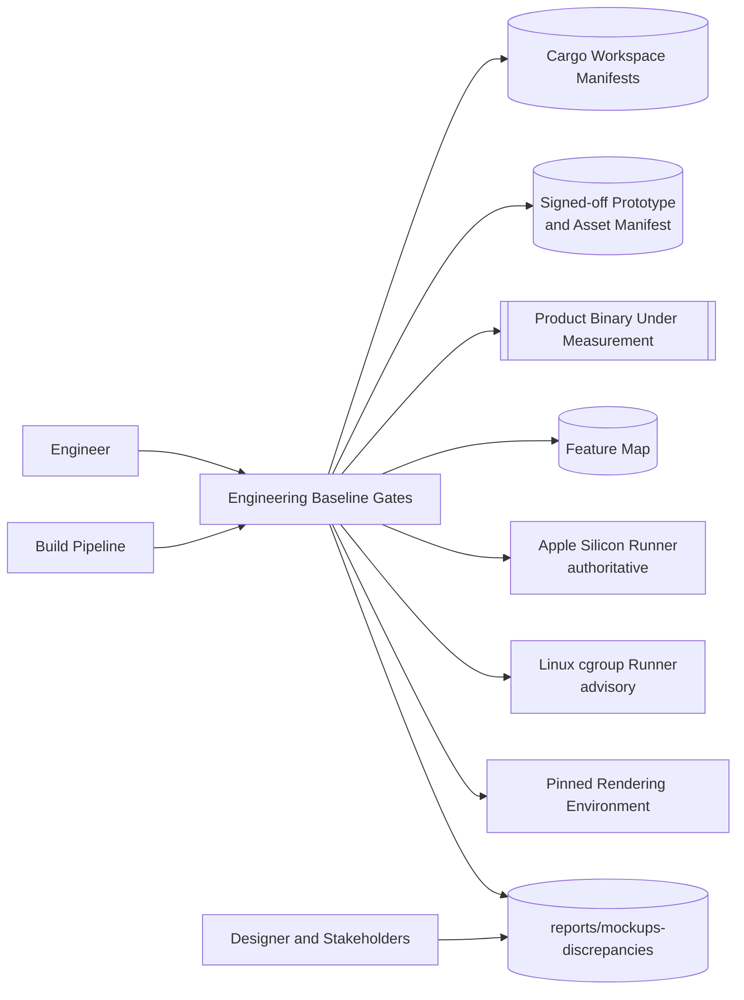
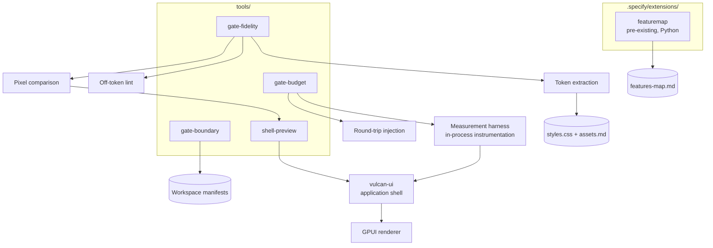
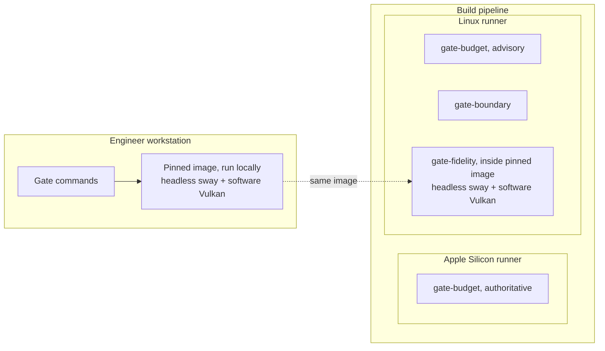
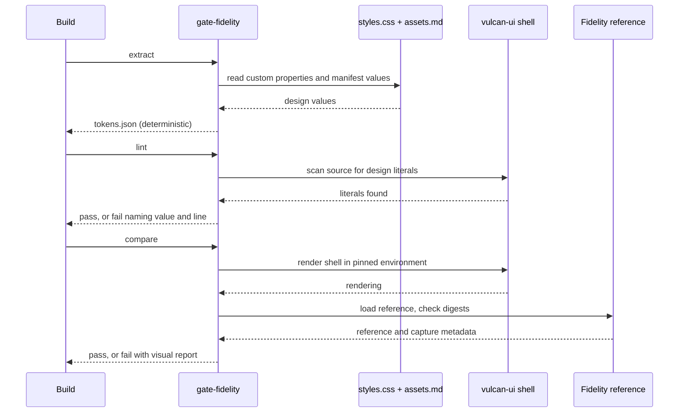
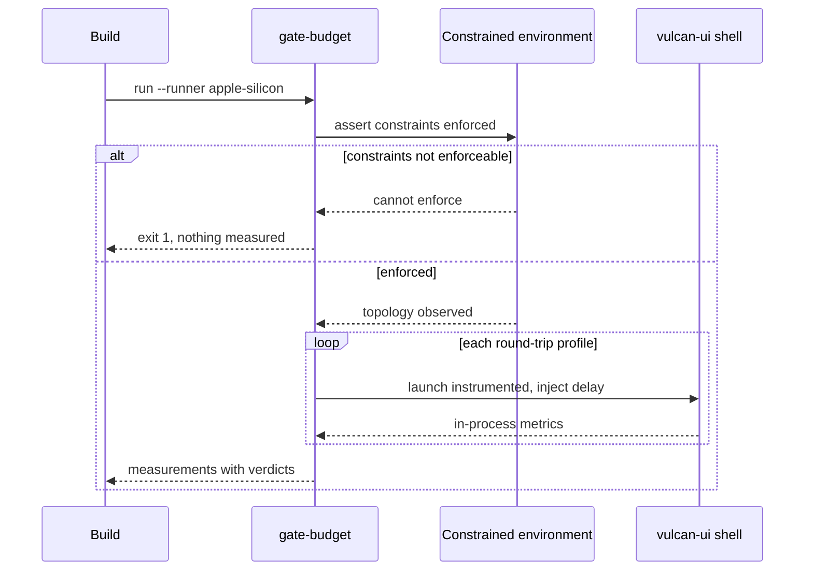

# Architecture: Engineering Baseline

**Branch**: `001-engineering-baseline` | **Date**: 2026-09-18 | **Plan**: [plan.md](./plan.md)

**Input**: Implementation plan from `/specs/001-engineering-baseline/plan.md`

## Architectural Overview

Four gates, three of them new, and the application shell they measure. Each gate is a separate
command that reads the repository or runs the shell and returns a verdict; they share no state
and run independently, which is what lets the build run them in parallel and an engineer run one
at a time.

The shell is here rather than in a later feature because a budget measured against a placeholder
measures nothing. It renders every region the prototype composes and responds to input, while
performing no work behind its controls.

The architectural idea a reader most needs to hold is that **layering is expressed as crates,
not folders**. `vulcan-domain`, `vulcan-app`, `vulcan-adapters` and `vulcan-cli` are separate
workspace members, so a dependency that points the wrong way is a compile error before it is
ever a gate finding. Gate 1 therefore checks a dependency graph of four manifests rather than
parsing imports across the tree.

The second idea is that two gates refuse rather than guess. The budget gate exits `1` when it
cannot enforce its constraints, and the fidelity comparison exits `1` outside its pinned
environment. A measurement taken on the wrong machine and a comparison taken with the wrong
fonts are not weaker evidence; they are evidence about something else.

## System Context

## Component Architecture

| Component | Responsibility | Entities owned |
|-----------|----------------|----------------|
| `gate-boundary` | Read workspace manifests, judge the dependency graph against declared layering | `LayerEdge` |
| `gate-budget` | Run the product under constraints, measure every budget, judge against the constitution | `BudgetMeasurement` |
| `gate-fidelity` | Extract tokens, lint for off-token literals, capture and compare renderings | `DesignValue`, `FidelityReference` |
| `vulcan-ui` | Render every region of the approved interface and respond to input, performing no work behind controls | `InterfaceRegion`, `DensityProfile` |
| `shell-preview` | Run the shell standalone so the gates can capture and measure it | none |
| `featuremap` | Resolve what may be specified next, refuse out-of-sequence work | `BacklogEntry` |
| Discrepancy records | Written by people, referenced by design documents | `Discrepancy` |

`vulcan-ui` is an inbound adapter, not a layer: it maps input to use cases and renders their
output, so GPUI types never reach the application or domain crates. Gate 1 enforces that from the
first commit, which is what bounds the F002 retrofit when the shell is re-hosted through plugin
extension points.

## Deployment Topology

Nothing is deployed to a server. The only meaningful boundary is between the two runners: the
same command produces an authoritative verdict on one and an advisory one on the other, and
the report says which it was.

## Data Flow

## Cross-Cutting Concerns

| Concern | Approach |
|---------|----------|
| Authentication / authorization | N/A - every gate runs locally against the repository and the product; none exposes a network surface or handles credentials. |
| Error handling | Three exit codes with distinct meanings: `0` judged and passed, `2` judged and failed, `1` could not judge. Errors that prevent judgement never produce a verdict, which is what stops a missing prerequisite from reading as success. |
| Observability | Each gate emits a structured report with `--json` and writes it with `--report`. Reports carry the inputs that make a verdict reproducible: core topology, prototype digest, environment digest, round-trip profile. |
| Configuration | Budgets come from the constitution and are compiled in, not configurable per run, so that a failing build cannot be fixed by editing a threshold. Paths and runner selection come from command-line arguments. The shell's six properties come from `contracts/shell-ui.md` and take effect at runtime. |
| Command routing | Every shell control routes to a single no-op sink. That sink is the seam F002 replaces with real dispatch, which is why it is one place rather than a stub per control. |

## Architectural Decisions

| Decision | Recorded in |
|----------|-------------|
| Layers are crates; the dependency graph is the boundary | [Layering enforcement mechanism](./research.md#layering-enforcement-mechanism) |
| GPUI renders the client and the reproduction | [User interface framework](./research.md#user-interface-framework) |
| Two runners, Apple Silicon authoritative | [Budget measurement hardware](./research.md#budget-measurement-hardware) |
| Rust for gates 1, 5, 8; Python retained for gate 9 | [Gate tooling language](./research.md#gate-tooling-language) |
| The shell is an inbound adapter in `vulcan-ui` | [Shell placement in the architecture](./research.md#shell-placement-in-the-architecture) |
| Controls respond but perform no work | [Behaviour boundary for the shell](./research.md#behaviour-boundary-for-the-shell) |
| Undepicted states are recorded before implementation | [Prototype extension enforcement](./research.md#prototype-extension-enforcement) |
| Exact comparison inside one pinned headless Wayland session | [Visual comparison environment](./research.md#visual-comparison-environment) |
| Tokens come from the stylesheet and the asset manifest | [Prototype token sources](./research.md#prototype-token-sources) |
| Round-trip delay injected locally at four profiles | [Network profile simulation](./research.md#network-profile-simulation) |
| The sequencing tooling is adopted, not rebuilt | [Pre-existing sequencing tooling](./research.md#pre-existing-sequencing-tooling) |

## Phase 1 Reconciliation

| Conflict with data-model.md or contracts/ | Action taken |
|-------------------------------------------|--------------|
| `data-model.md` gives `BudgetMeasurement` an `authoritative` flag, while the deployment topology makes authority a property of the runner rather than of the measurement. | Architecture adjusted to state that the report records which runner produced it; the flag is retained as derived from `runner`, not independently set. No artifact revised. |
| `contracts/gates-cli.md` defines exit `1` for "could not run", while the architecture originally described only pass and fail. | Architecture adjusted: the three-code scheme is now stated in Cross-Cutting Concerns as a first-class idea rather than a convention buried in the contract. |
| `data-model.md` defines `Discrepancy` with a `triage` field, but no component owns it — it is written by people. | Accepted as correct rather than reconciled away. The Component Architecture table lists it with a human owner, because inventing a component to own a document would misrepresent how it is produced. |
| `shell-preview` owns no entity, which makes it look like a gap in the component table. | No change. It is a launcher, not a store; recording "none" is more honest than attaching an entity to it. |
| `contracts/shell-ui.md` fixes region extents, while `data-model.md` gives `InterfaceRegion` a nullable `fixed_extent`. | No conflict: the contract lists the regions the prototype fixes, the entity allows regions it does not. Recorded so a reader does not mistake the nullable field for an omission. |
| The shell renders regions but owns no use case of its own, which reads oddly against Principle III. | Architecture adjusted: the shell routes every control to a no-op command sink, which is itself the use-case seam F002 replaces. Stated in Cross-Cutting Concerns rather than left implicit. |
