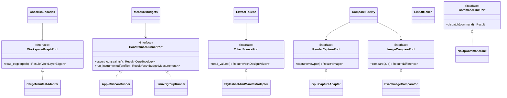
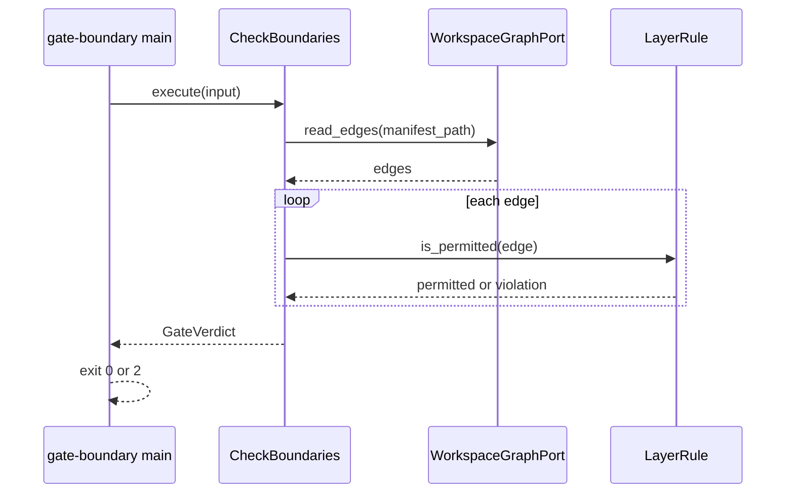
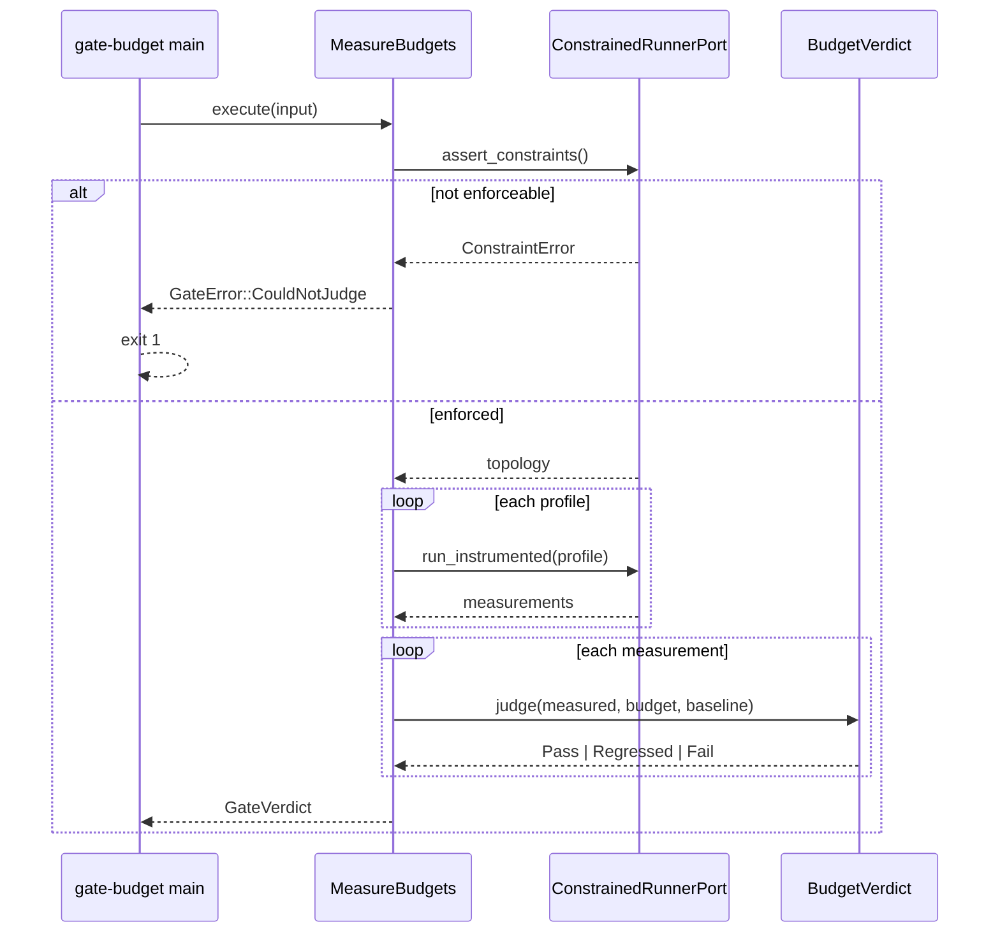
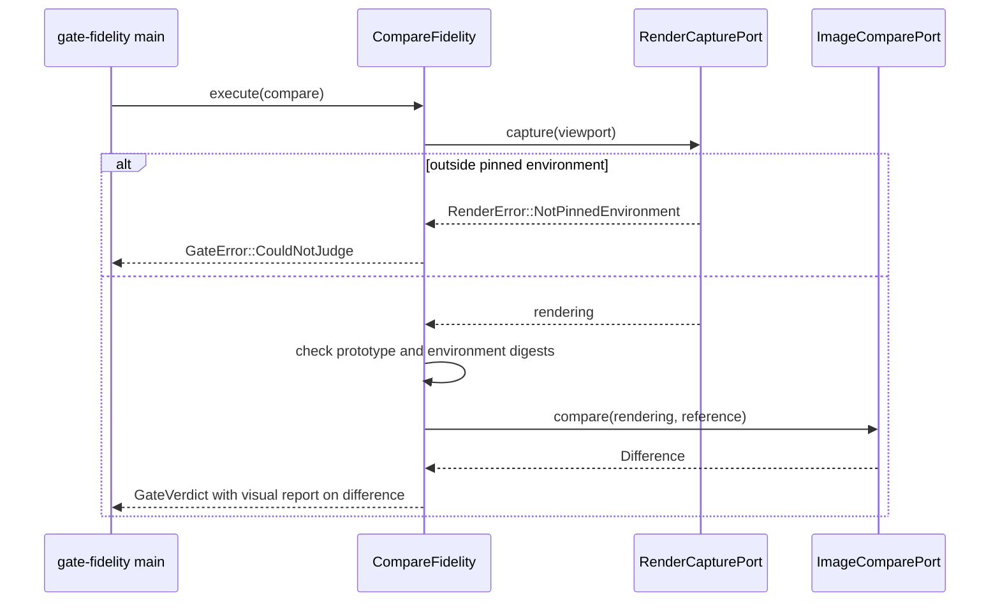
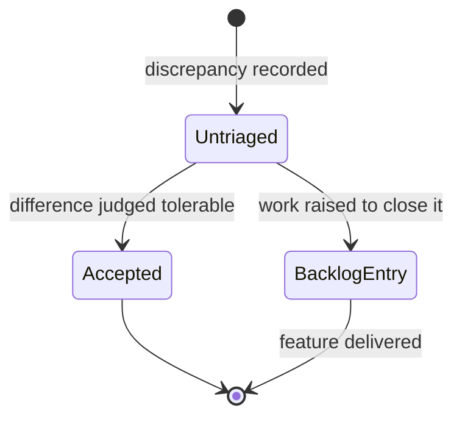
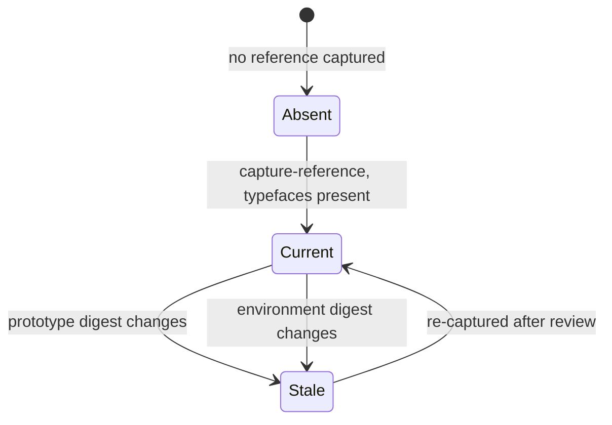

# Design: Engineering Baseline

**Branch**: `001-engineering-baseline` | **Date**: 2026-09-18 | **Plan**: [plan.md](./plan.md)

**Input**: Implementation plan from `/specs/001-engineering-baseline/plan.md` and system shape
from `/specs/001-engineering-baseline/architecture.md`

Language and version: Rust 1.83+ (2021 edition) for gates 1, 5 and 8; Python 3.11+ for the
pre-existing gate 9. See [plan.md](./plan.md) Technical Context.

## Module & File Layout

```text
crates/
├── vulcan-domain/src/lib.rs        # Entities and rules. No dependencies.
├── vulcan-app/src/
│   ├── ports/                      # Outbound port traits
│   └── use_cases/                  # Gate orchestration
├── vulcan-adapters/src/
│   ├── manifest/                   # Cargo manifest reading
│   ├── measurement/                # Constrained execution, instrumentation, netem
│   ├── rendering/                  # GPUI capture, image comparison
│   └── tokens/                     # CSS and manifest parsing
├── vulcan-ui/src/                  # Shell: inbound adapter, Adapters layer
│   ├── shell.rs                    # Window and root layout
│   ├── chrome/                     # toolbar.rs, rail.rs, status_bar.rs
│   ├── panels/                     # tool_window.rs, dock.rs, terminal_view.rs, diagnostics_view.rs
│   ├── editor/                     # tabs.rs, surface.rs, completion.rs
│   ├── overlays/                   # palette.rs, run_config.rs, packs.rs
│   ├── props.rs                    # The six prototype properties
│   ├── motion.rs                   # vkpulse, the only animation
│   └── commands.rs                 # No-op command sink
└── vulcan-cli/src/                 # Composition root

tools/
├── gate-boundary/src/main.rs       # Inbound adapter: args -> use case
├── gate-budget/src/main.rs
├── gate-fidelity/src/main.rs
└── shell-preview/src/main.rs       # Runs the shell standalone for capture and measurement

.specify/extensions/featuremap/scripts/python/feature_map.py   # Gate 9, pre-existing
```

The four `tools/` binaries are workspace members so they compile and test with everything
else. They are inbound adapters: argument parsing and exit codes, nothing more.

## Class & Interface Model



| Type | Kind | Responsibility |
|------|------|----------------|
| `WorkspaceGraphPort` | trait | Supply declared dependency edges between crates |
| `ConstrainedRunnerPort` | trait | Prove constraints are enforced, then run and measure |
| `TokenSourcePort` | trait | Supply design values from the prototype's two sources |
| `RenderCapturePort` | trait | Render a composition and return an image |
| `ImageComparePort` | trait | Compare two images exactly |
| `CheckBoundaries` | use case | Judge the graph against declared layering |
| `MeasureBudgets` | use case | Produce measurements and verdicts across profiles |
| `ExtractTokens` | use case | Produce the deterministic design value set |
| `LintOffToken` | use case | Reject literals outside the extracted set |
| `CompareFidelity` | use case | Judge a rendering against the reference |
| `CommandSinkPort` | trait | Receive a control activation; the seam F002 replaces with real dispatch |
| `Shell` | adapter | Own the window and root layout, compose every region |
| `DensityProfile` | domain | Resolve every density-dependent dimension from the token set |
| `LayerRule` | domain | Decide whether an edge is permitted |
| `BudgetVerdict` | domain | Decide pass, fail or regression from measured and budget |

## Interface Contracts

Signatures only. Formal command-line and file contracts live in
[contracts/](./contracts/gates-cli.md).

```text
Rust

trait CommandSinkPort {
    fn dispatch(&self, command: CommandId) -> Result<(), DispatchError>
        precondition:  none
        postcondition: in this feature, always Ok and no work performed
        raises:        none

    // F002 replaces the implementation, not the signature. Controls call this and
    // nothing else, so no control can partly act.
}

trait WorkspaceGraphPort {
    fn read_edges(&self, manifest_path: &Path) -> Result<Vec<LayerEdge>, GraphError>
        precondition:  manifest_path names a readable Cargo workspace
        postcondition: every workspace member appears as `from` at least once, or has no dependencies
        raises:        GraphError::Unparseable, GraphError::UndeclaredLayer
}

trait ConstrainedRunnerPort {
    fn assert_constraints(&self) -> Result<CoreTopology, ConstraintError>
        precondition:  none
        postcondition: returns observed topology only when limits are enforced, not merely requested
        raises:        ConstraintError::NotEnforceable

    fn run_instrumented(&self, profile: RoundTripProfile)
        -> Result<Vec<BudgetMeasurement>, MeasurementError>
        precondition:  assert_constraints has succeeded in this process
        postcondition: one measurement per metric; none omitted silently
        raises:        MeasurementError::ProductFailedToStart, MeasurementError::MetricUnavailable
}

trait TokenSourcePort {
    fn read_values(&self) -> Result<Vec<DesignValue>, TokenError>
        precondition:  prototype stylesheet and asset manifest are readable
        postcondition: values sorted by name; identical inputs yield an identical vector
        raises:        TokenError::DuplicateName, TokenError::Unparseable
}

trait RenderCapturePort {
    fn capture(&self, viewport: Viewport) -> Result<Image, RenderError>
        precondition:  running inside the pinned environment
        postcondition: image dimensions equal viewport
        raises:        RenderError::NotPinnedEnvironment, RenderError::TypefaceMissing
}

trait ImageComparePort {
    fn compare(&self, actual: &Image, reference: &Image) -> Result<Difference, CompareError>
        precondition:  both images share dimensions
        postcondition: Difference::None only when every pixel matches exactly
        raises:        CompareError::DimensionMismatch
}

struct CheckBoundaries<G: WorkspaceGraphPort> {
    fn execute(&self, input: CheckBoundariesInput) -> Result<GateVerdict, GateError>
        precondition:  none
        postcondition: verdict names every offending edge with its manifest location
        raises:        GateError::CouldNotJudge
}

struct MeasureBudgets<R: ConstrainedRunnerPort> {
    fn execute(&self, input: MeasureBudgetsInput) -> Result<GateVerdict, GateError>
        precondition:  none
        postcondition: on success, a measurement exists for every metric in every requested profile
        raises:        GateError::CouldNotJudge
}
```

`GateError::CouldNotJudge` maps to exit `1` at the inbound adapter, and is deliberately
distinct from a failing `GateVerdict`, which maps to exit `2`.

## Sequence Diagrams







## State Model

Gates are stateless: each run judges the repository as it stands and holds nothing between
runs. Two entities do have a lifecycle.



```mermaid
stateDiagram-v2
    [*] --> Default: shell starts
    Default --> Compact: density property set
    Default --> Roomy: density property set
    Compact --> Default: density property set
    Roomy --> Default: density property set
    note right of Default
        Every transition re-resolves
        dependent dimensions within
        the frame budget, no reload
    end note
```



A stale reference is a distinct state rather than a failure, because it means the prototype or
the environment moved, not that the product regressed. Reporting it as a comparison failure
would teach people to re-baseline reflexively.

## Error Handling & Validation

| Condition | Behavior | Surfaced where |
|-----------|----------|----------------|
| Manifest unparseable or crate has no declared layer | Refuse to judge | exit `1`, stderr names the file |
| Dependency edge points outward | Fail | exit `2`, report names both crates and the manifest line |
| Constraints requested but not enforced | Refuse to measure; write nothing | exit `1`, report absent by design |
| Metric cannot be measured | Refuse the whole run rather than omit a metric | exit `1` |
| Budget exceeded on the authoritative runner | Fail | exit `2`, naming metric, budget, measured value |
| Within budget but more than ten percent worse | Pass with `Regressed` | exit `0`, report requires explanation in review |
| Two token sources declare the same name differently | Refuse extraction | exit `1`, naming both source locations |
| Design literal outside the extracted set | Fail | exit `2`, naming value, file and line |
| Typeface declared by the prototype is absent | Refuse to capture a reference | exit `1` |
| `compare` invoked outside the pinned environment | Refuse to compare | exit `1` |
| Prototype or environment digest changed | Report stale reference, not regression | exit `2` with a distinct message |
| Any pixel differs | Fail | exit `2`, with a visual report |
| Feature map contradicts itself | Refuse to answer any sequencing question | exit `2` (pre-existing behaviour) |
| Shell reaches a state the prototype omits with no recorded extension | Fail the build | exit `2`, naming the state |
| A control is wired to anything other than the no-op sink | Fail the build | exit `2`; partial behaviour is a contract violation, not progress |
| Density profile missing a dimension | Refuse to start the shell | exit `1`, naming the dimension |

## Persistence Mapping

| Entity (see [data-model.md](./data-model.md)) | Owning type | Notes |
|-----------------------------------------------|-------------|-------|
| `LayerEdge` | `CargoManifestAdapter` | Read per run from manifests; never stored |
| `BudgetMeasurement` | `MeasurementReportStore` | Written as JSON; the previous run's file is the baseline for regression comparison |
| `DesignValue` | `TokenSetStore` | Written as sorted JSON; byte-identical across runs over an unchanged prototype |
| `FidelityReference` | `ReferenceStore` | Image plus metadata sidecar, one per composition |
| `Discrepancy` | none — authored by people | One Markdown document per discrepancy under `reports/mockups-discrepancies/`; design documents link to it and never restate it |
| `PrototypeExtension` | none — recorded in the owning feature's design document | Validated against the extracted `DesignValue` set |
| `InterfaceRegion` | `Shell` in `crates/vulcan-ui/src/shell.rs` | Composed at start-up from the extracted token set; not persisted |
| `DensityProfile` | `Props` in `crates/vulcan-ui/src/props.rs` | Three profiles resolved from the token set; the active one is in-memory only |
| `BacklogEntry` | `feature_map.py` (Python, pre-existing) | Parsed from `specs/features-map.md` on each invocation; the Markdown file is the store |

## Pre-existing: the sequencing extension

Gate 9 was built before this workflow was applied to it, so this section records what it
is rather than proposing what it should be. It closes the Principle VII item in
[plan.md](./plan.md) Complexity Tracking by documenting the shape as found.

| Aspect | As built |
|--------|----------|
| Location | `.specify/extensions/featuremap/`, vendored from the spec-kit fork that maintains it |
| Entry point | `scripts/python/feature_map.py`, roughly 500 lines, no third-party imports |
| Store | `specs/features-map.md`; the Markdown file is the database, parsed on each invocation |
| Commands | `resolve [F<NNN>]`, `verify`, `add`, `record-spec` |
| Exit codes | `0` resolved or consistent, `2` blocked or contradictory, `1` could not read the map |
| Enforcement | The `before_specify` hook, so a feature cannot be specified out of order |
| Tests | 30 behaviour tests in `tests/test_feature_map_script.py`, vendored beside the script |

The tests are vendored deliberately. The extension is maintained in the spec-kit repository,
but the copy in this repository is the one that decides whether a feature may be specified,
and an untested vendored copy can drift from its source without anything noticing. They run
in the build as the `Gate 9 - sequencing script tests` step.

Their structure is `unittest`-style behaviour tests executed under `pytest`, not the
domain/use-case/adapter tiers Principle V describes. They are accepted as characterisation
tests, which is what that principle asks for before modifying untested code, and restructuring
them would change no behaviour while risking the gate every later feature depends on.

## Prototype extensions

States the shell can reach that the prototype does not depict. Each is derived from the
extracted token set; none introduces a design value, which the off-token lint would reject.
This list is enforced: `crates/vulcan-ui/tests/prototype_extensions.rs` reads it, compares it
against the states the shell declares, and fails the build on either an unrecorded state or a
record for a state that no longer exists.

### Tool window collapsed

**State.** `Props::side_collapsed`, reached from the collapse control in the tool window
header.

**Why the prototype omits it.** The prototype depicts the control — `collapseIcon` is
`ph-caret-double-left` on a button in the tool window header — but binds no state to it, so
the collapsed layout is never composed. The dock's equivalent is depicted, because the
prototype does carry `dockOpen: false`.

**Derivation.** The rail keeps its extracted width (`--chrome-rail-width`, 44px) and the
editor takes the freed space. No dimension, colour or typeface outside the extracted set is
introduced: the collapsed layout is the composed layout with one region's width removed.

**Sign-off.** Pending. Recorded here so the state is visible at review rather than discovered
in a screenshot.

### Local history tool window

**State.** `RailTab::History`, reached from the rail's local history tab.

**Why the prototype omits it.** The prototype offers the feature as a palette command,
`Toggle local history — per-file rope snapshots`, but composes no tool window for it. The
rail tab exists in the reproduction because the shell must show every rail destination; the
panel behind it has no depicted design.

**Derivation.** The panel reuses the tool window composition already extracted for the
project tree: the same header height (`--chrome-tool-header`), row height from the active
density profile, and the same type and colour ramps. Nothing is introduced beyond arranging
existing tokens.

**Sign-off.** Pending, and the stronger candidate of the two extensions for rejection: if the
designer would rather this tab not exist until F00x owns local history, removing it is
cheaper than designing it.
